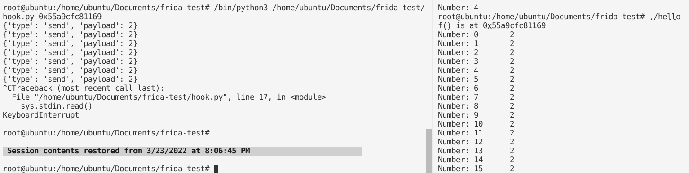
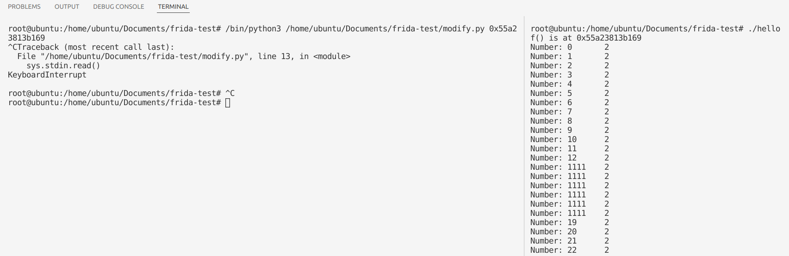
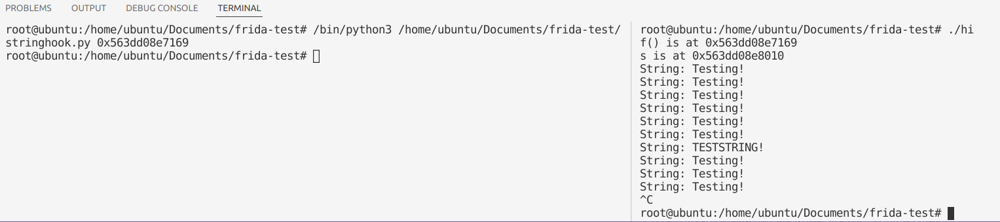
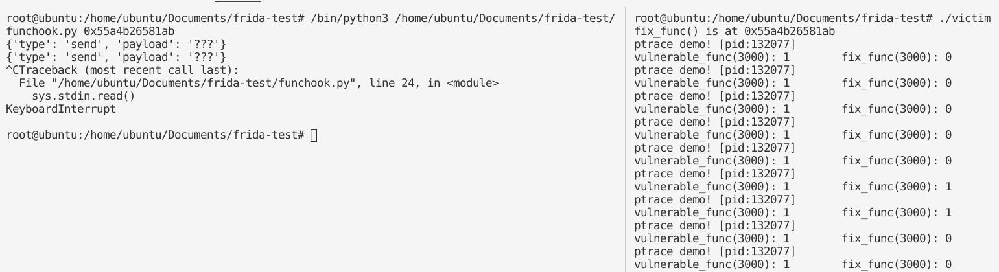

### frida试用


hello.c

```c
#include <stdio.h>
#include <unistd.h>

void f (int n, int m)
{
  printf ("Number: %d\t%d\n", n, m);
}

int main (int argc, char * argv[])
{
  int i = 0;
  printf ("f() is at %p\n", f);
  while (1) {
    f (i++, 2);
    sleep (1);
  }
  return 0;
}
```

hook.py

```python
from __future__ import print_function
import frida
import sys

session = frida.attach("hello")
script = session.create_script("""
Interceptor.attach(ptr("%s"), {
    onEnter: function(args) {
        send(args[1].toInt32());
    }
});
""" % int(sys.argv[1], 16))
def on_message(message, data):
    print(message)
script.on('message', on_message)
script.load()
sys.stdin.read()
```




modify.py：更改函数调用参数

```python
import sys
import frida

session = frida.attach("hello")
script = session.create_script("""
Interceptor.attach(ptr("%s"), {
    onEnter: function(args) {
        args[0] = ptr("1111");
    }
});
""" % int(sys.argv[1], 16))
script.load()
sys.stdin.read()
```




hi.c

```c
#include <stdio.h>
#include <unistd.h>

int f (const char * s)
{
  printf ("String: %s\n", s);
  return 0;
}

int main (int argc, char * argv[])
{
  const char * s = "Testing!";

  printf ("f() is at %p\n", f);
  printf ("s is at %p\n", s);
  while (1)
  {
    f (s);
    sleep (1);
  }
  return 0;
}
```

stringhook.py：注入字符串并调用函数

```python
from __future__ import print_function
import sys
import frida

session = frida.attach("hi")
script = session.create_script("""
var st = Memory.allocUtf8String("TESTSTRING!");
var f = new NativeFunction(ptr("%s"), 'int', ['pointer']);
f(st);
""" % int(sys.argv[1], 16)) 

def on_message(message, data):
    print(message)
script.on('message', on_message)
script.load()
```







接口设计

frida是基于Hook的动态分析工具。是一款基于 python+javascript 的 hook 框架，核心是用C编写的，可运行在 android、ios、linux、win等各个平台，主要使用的动态二进制插桩技术。


https://mabin004.github.io/2018/07/31/Mac%E4%B8%8A%E7%BC%96%E8%AF%91Frida/
