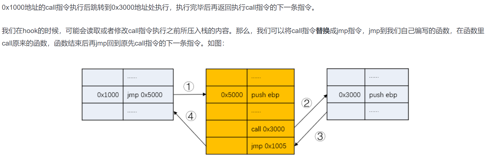

## hook方式总结

### ptrace方式

链接：https://github.com/irving-11/ProcessInjectionDemo/tree/main/patch-demo/ptrace-demo

`ptrace`(Process Trace)系统调用提供了一种机制用来观察和控制其他进程的执行, 并且可以检查和修改其核心映像和寄存器。通常用来作为调试器(如gdb)和跟踪各种其他系统调用。常见的两种追踪模式为PTRACE_TRACEME（指示此进程被追踪） 和 PTRACE_ATTACH（用于主动追踪）。

ptrace函数通过四个参数来调用, 其原型为:

```c
long ptrace(enum __ptrace_request request, pid_t pid, void *addr, void *data);
```


**hook思路**：

attach并追踪正在运行的进程，读取其指令寄存器IR（%rip）的内容，备份后替换成目标指令，再使其返回运行，此时被追踪进程就会执行目标指令，执行完毕后，再恢复原进程的IR，从而改变了原进程的执行逻辑。


### inline hook方式

链接：https://github.com/irving-11/ProcessInjectionDemo/tree/main/patch-demo/inlinehook-demo

inline hook是通过**修改函数执行指令**来达到挂钩的，修改指令时，需要使用函数mprotect()**修改代码所在内存空间的权限**。



通常是针对5字节的call进行inline hook，但是在寻找call的时候可能会遇到许多不同的call，比如6字节的call，或者7字节的call，或者复杂的情况需要借助反汇编引擎的帮助。


### plt hook方式

链接：https://github.com/kubo/plthook

在 ELF 文件格式中我们只有函数的绝对地址。如果想在系统中运行，这里需要经过**重定位**。

- **The Global Offset Table (GOT)**。简单来说就是在数据段的地址表，假定我们有一些代码段的指令引用一些地址变量，编译器会引用 GOT 表来替代直接引用绝对地址，因为绝对地址在编译期是无法知道的，只有重定位后才会得到 ，GOT 自己本身将会包含函数引用的绝对地址。
- **The Procedure Linkage Table (PLT)**。PLT 不同于 GOT，它位于代码段，动态库的每一个外部函数都会在 PLT 中有一条记录，每一条 PLT 记录都是一小段可执行代码。 一般来说，外部代码都是在调用 PLT 表里的记录，然后 PLT 的相应记录会负责调用实际的函数。我们一般把这种设定叫作“蹦床”（Trampoline）。

PLT 和 GOT 记录是一一对应的，并且 GOT 表第一次解析后会包含调用函数的实际地址。PLT 从某种意义上赋予一种lazy load的能力。当动态库首次被加载时，所有的函数地址并没有被解析。


大致步骤：

１．如何根据动态库的函数名称知道对应的地址 首先通过 dlopen加载对应的动态库，获得该动态库的句柄

```c
void *hndl = dlopen(filename, RTLD_LAZY | RTLD_NOLOAD);
```

通过dlsym获取各个函数符号在共享库中的相对地址

```c
char *addr = dlsym(hndl, symbols[i])
```

函数实际被加载到内存的地址应为 该共享库的基地址＋该函数的相对地址，因此，还需要获取对应共享库的基地址。 可以通过dl_iterate_phdr 遍历程序当前加载的动态库，从而获取基地址, dl_iterate_phdr　传入的第一个参数为回调函数，该函数的具体定义可以通过 man dl_iterate_phdr来查看

```c
struct dl_iterate_data data = {0,};
data.addr = address;
//遍历共享库，获取address实际的内存地址
dl_iterate_phdr(dl_iterate_cb, &data);
```

2.  替换函数地址 首先在遍历动态库时，已经将动态库的基地址保存，此时通过获取到源函数在plt表中的位置，并将该地址值替换成目标地址值即可

