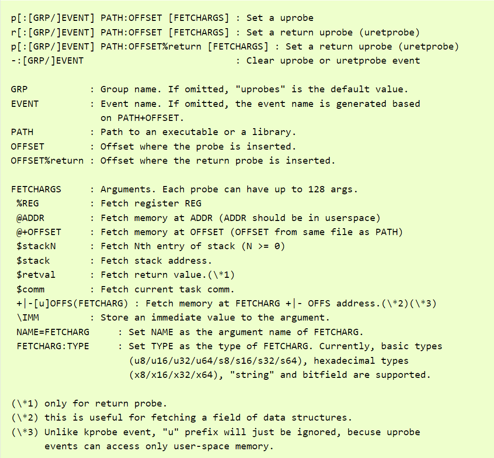
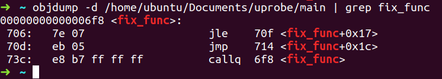
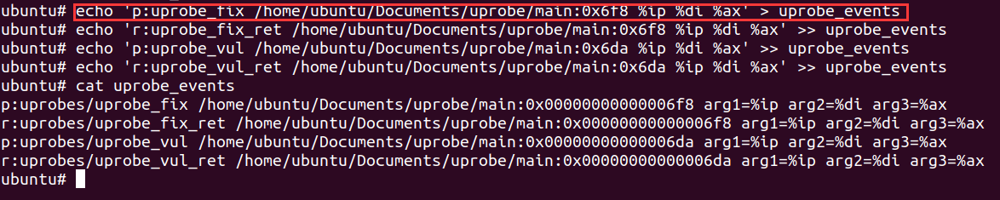
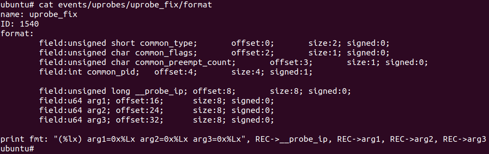
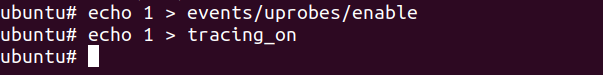
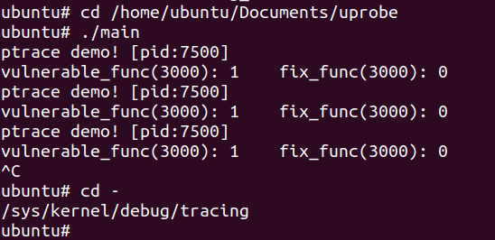

### uprobe使用

需要在编译内核时开启CONFIG_UPROBE_EVENTS=y选项。通过/sys/kernel/debug/tracing/uprobe_events添加探针，通过/sys/kernel/debug/tracing/events/uprobes/<EVENT>/enable将其激活。

使用uprobe需要**用户**计算探针点在目标中的**偏移**。

uprobe试用

找待跟踪函数的偏移

添加uprobe与uretprobe

format of events

激活探针并跟踪

执行待观测函数

查看结果

参考：https://www.kernel.org/doc/html/latest/trace/uprobetracer.html

