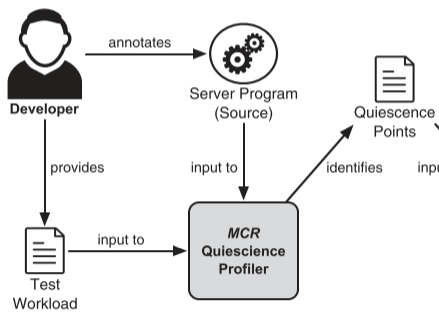

# Automating Live Update for Generic Server Programs

通用服务器程序的自动化实时更新

### 相关工作

#### 静止点检测

静止点用于限制程序在检查点的可能程序状态数量，确保程序在安全的状态（例如所有程序线程都等待socket事件而处于block状态）实施更新。

静止点检测算法

- 单个函数层面：无法保证一致性；依赖于被动的栈检查而无法在有限时间内保证收敛

- 通用事件层面：依赖于更新友好的系统设计或者显示的线程级别的更新点

  - ​	free riding：让程序运行直到所有线程恰好同时到达合法的更新点

    缺点：无法保证在有限时间内收敛；需要突然中断正在进行的阻塞调用，否则可能无限期延迟静止，

    通过静态分析扩展更新点的数量或者采用函数层面的更新点，会都引入较大开销且仍然无法保证收敛。

  - ​	barrier synchronization：在每个线程的下一个合法更新点立即停止线程

    缺点：忽略了线程间的依赖关系，容易死锁；需要突然中断正在进行的阻塞调用，否则可能无限期延迟静止

    

    解决方案：使用注解与信号结合，或者注解与文件描述注入结合的方式。

    

#### 控制迁移

在重启后恢复所有更新的程序线程。

| in-place更新           | 系统设计导向的控制迁移     | 栈重构                 | 明确的控制迁移注解 |
| ---------------------- | -------------------------- | ---------------------- | ------------------ |
| 不需要控制迁移         | 原生支持迁移               | 可立即更新             | 容易实现           |
| 无法进行特定类型的更新 | 限制大，不适合目前的服务器 | 需要人工进行调用栈映射 | 开发者控制迁移     |

#### 状态转换

重启后，重新映射不同版本之间的程序状态。

| in-place更新                     | 开发者完成状态映射 | 使用精确的GC跟踪重构状态 |
| -------------------------------- | ------------------ | ------------------------ |
| 完全由开发者控制；不支持指针转换 |                    | 需要大量注解工作         |

## MCR

步骤：

1. 程序注解与配置
2. 插桩与编译
3. 启动时记录与运行时监控
4. 实时更新

### 配置指导的静止

在运行时分析程序并自动识别静止点（即安全阻塞长时间运行线程的位置）

#### 静止点识别

利用静态插桩跟踪进程与线程，以拦截运行时函数调用、库调用、循环进出；利用测试负载，驱动程序进入所有可能的更新时合法的“执行停止”的状态。

“停止点”可通过识别阻塞调用来识别，循环通过标准循环分析技术识别。根据静止点检测协议，对”停止点“做如下分类：1）静止点：合理的静止状态  2）阻塞点：在到达下一个静止点前可停止的点  3）取消点：在静止点检测时可返回错误

解除阻塞？？？

#### 静止点检测协议

barrier synchronization（屏障同步）

- 发起者线程——因外部事件而阻塞
- 内部线程——等待线程处理内部事件

挑战：在不阻塞线程的情况下自动决定等待内部事件完成的时间

方案：等待所有线程到达一个静止点，而自上一个静止点以来没有收到任何事件。这种策略有效地将原来的全局静止检测问题简化为局部静止检测问题 。使用RCU（一种可扩展、低延迟和无死锁的局部静止检测方案）。

### 可变重新初始化

可变重新初始化旨在将新版本中所有更新的程序线程（和进程）恢复到与更新时在旧版本中获得的静止状态相同的静止状态。 这是为了在新版本中完成控制迁移，并自动重新初始化全局数据结构的最大可能部分。 为了最大限度地减少注释的数量，可变重新初始化依赖于一个关键的观察结果，即运行服务器程序的启动代码往往会初始化长期存在的服务器线程（和进程）并收敛到与旧版本中的状态非常匹配的静止状态。 特别是当服务器模型产生稳定的静止状态时（例如，在事件驱动的服务器中），这种策略可以完全自动化整个过程，不需要额外的注释。

**只重放引用不可变状态对象的操作**

#### 处理不可变状态对象

1）从旧版本继承的文件描述符编号——由于相关的内核状态，不可变；

2）由可变跟踪识别的不可变内存对象地址——由于对全局指针的部分了解而不可变；

3）进程/线程 ID——它们携带特定于进程的状态，这些状态可能存储在必须转移到新版本的全局数据结构中

1. 全局继承：新版本中的第一个进程在允许启动代码运行之前从旧版本中的所有进程中继承所有不可变对象。这个想法是预先分配所有必要的不可变对象以避免对象冲突，并在新版本中将所有对象逐步传播到进程层次结构中以用于重放目的。
2. 全局可分离性：在启动时创建的所有不可变对象获取全局唯一标识符，从而防止重用引入的歧义。对于启动后创建的不可变对象，不需要防止重用，它们不是重放操作的目标，只是从旧版本继承。

#### 进行匹配

只有在与旧版本记录的启动日志完美匹配时，系统调用才会自动重放。 

为了在由于不确定性或任意版本更改而导致操作重新排序的情况下强制执行保守匹配策略，可变重新初始化依赖于与所考虑的每个操作相关联的调用堆栈 ID。 调用堆栈 ID 以与版本无关的方式表示每个记录的（或重放的）系统调用的上下文，是通过对发出系统调用的线程的调用堆栈上的所有活动函数名称进行散列来计算的。 调用堆栈 ID 用于将重放时观察到的每个系统调用与旧启动日志中记录的相应系统调用进行匹配。 当发现不匹配时，可变重新初始化会暂停重放操作并立即标记冲突。 

### 可变追踪

精确追踪+保守追踪

#### 精确追踪

1. 前端编译器生成的类型感知遍历函数
2. 关联到各个状态对象的内存中数据类型标签

前者通常更节省空间和时间，但后者可以更好地处理多态行为并提供更灵活的类型管理。MCR 采用后一种策略，以便在运行时根据需要从精确跟踪无缝切换到保守跟踪。

？？？？

MCR 的精确跟踪策略在新版本的每个静止进程中运行，在多进程上下文中完全并行化状态传输操作。 每个进程都请求一个中央协调器连接到由相同创建时间调用堆栈 ID 标识的旧版本（如果有）中的对应方。 一旦与旧进程建立连接，MCR 就会创建一个快速只读共享内存通道来传输旧版本中的所有重定位和数据类型标签。 从根全局和堆栈对象开始，MCR 跟踪指针链以重建旧版本中的整个程序状态，并将遍历中找到的每个对象重新映射到新版本——复制数据、重新分配对象和应用类型转换]。 还允许自定义指定的遍历处理程序来处理复杂的语义状态转换。

#### 保守追踪

可变追踪所采用的保守追踪策略对其精确追踪对应部分透明。 这个想法是首先执行保守分析以识别隐藏指针（即，未通过可用类型信息显式公开的指针）并为旧版本中的状态对象导出一些必要的不变量。 一旦跨版本保守地保留不变量，就可以在精确跟踪的基础上简单地实现状态转移，而不必担心隐藏指针和类型歧义。 特别是，我们的保守跟踪策略为旧版本中的每个对象生成两个可能的不变量：不变性——对象是不可变的，不能在新版本中重新定位——和不可更新性——对象不能在新版本通过我们的精确跟踪策略进行类型转换（在检测到类型更改的情况下会产生冲突）。

为了识别这些不变量，MCR 的操作类似于保守的垃圾收集器，扫描不透明（即类型不明确）的内存区域以寻找可能的指针——即指向内存中有效活动对象的对齐内存字。 可能指针指向的对象被标记为不可变和不可更新——我们可以将后者限制为仅内部指针（即对象中间的指针），但我们还没有实现这个选项。 包含可能指针的对象被标记为不可更新——我们可以将后者限制为仅更改某些类型，但我们还没有实现这个选项。 

请注意，我们的策略只是**部分保守**：MCR 默认使用我们的精确策略遍历程序状态，仅在遇到不透明区域时才切换到保守模式。

？？？

我们的保守跟踪策略提出了两个主要问题：准确性——在确定可更新性覆盖范围时分析的保守程度——以及执行分析的时间。

前者在实际程序中很少成为问题。 先前的工作报告说，即使是完全保守的 GC，在 64 位架构上也很少遇到类型准确性问题——尽管在 32 位架构上报告了更多问题。 其他研究证实，与活性准确度相比，类型准确度是微不足道的。 在我们的上下文中，只有那些积极使用自由列表或其他形式的重用的未检测分配器抽象才会出现活性准确性问题。 然而，如有必要，这些情况可以通过注释/工具轻松识别和补偿。 另请注意，与标准的保守 GC 技术不同，准确性问题（即可能的指针未反映真实和活动的指针）只会导致 MCR 无法自动类型转换的更不可变对象，但不会导致正在运行的程序的内存泄漏。

至于后者，我们的分析应该在旧版本静止后正常进行。 然而，这种策略通常会阻塞运行版本以重新链接程序并预链接共享库以重新映射不可重定位的不可变对象（例如，全局变量）。 幸运的是，我们已经观察到此类对象的非常稳定的不可变行为。 因此，我们当前的策略是简单地离线运行分析和重新链接操作。 如果在静止后发现不匹配——尽管我们在实践中从未遇到过这种情况——我们可以简单地扩展不可变对象集，恢复执行，允许在后台重新链接操作，并重复整个过程，直到检测到收敛。
