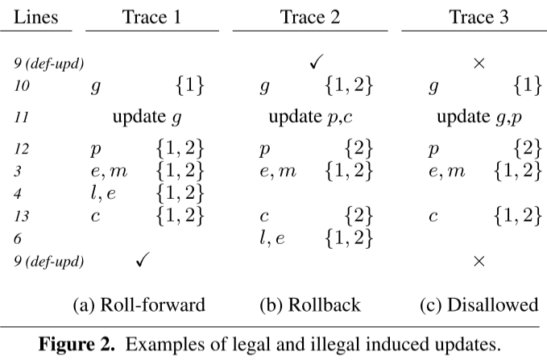
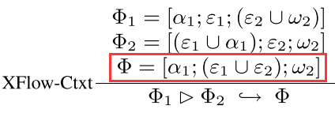
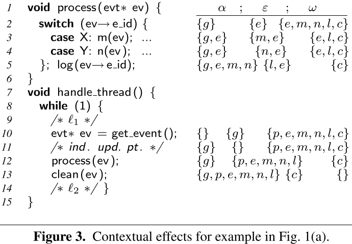
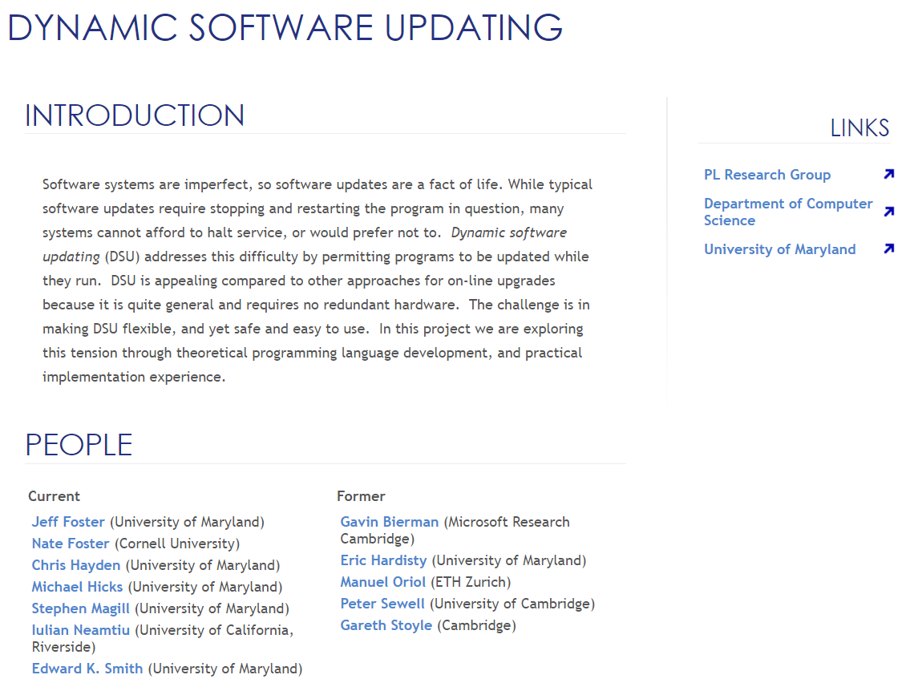

# Safe and Timely Dynamic Updates for Multi-threaded Programs

人们已经开发了许多动态更新系统，可以在程序运行时对其进行修补，以修复错误或添加新功能。 本文探讨了支持多线程程序动态更新的技术，重点关注及时应用更新同时仍然产生正确行为的问题。 过去的工作表明，单线程程序可以平衡这种安全性与及时性之间的紧张关系。 对于多线程程序，任务更加困难，因为无数线程交互使理解可以应用补丁的可能程序状态变得复杂。 我们的方法允许程序员指定可以应用补丁的几个程序点（例如，每个线程一个），这简化了关于安全性的推理。 为了提高及时性，静态分析和运行时支持的组合会自动将这几个点扩展到更多点，从而产生与原始点相同的行为。 对三个多线程服务器进行 13 次实际更新的实验表明，当更直接的替代方案会无限期地延迟某些更新时，我们可以在几毫秒内安全地执行动态更新。

barrier synchronization：缺点：死锁；性能损失。

↓

只要应用补丁时更新的效果语义上与之前方法同步，更新时可以不要求所有线程都处于 Σ 中的点。

## induced update points

update specification ： U = (π, Σ)

induced update point ： 补丁在 l' 处应用时，与补丁在更新点 l∈Σ 应用时，程序的行为相同，则 l' 为induced update point。

如图，

版本一致性跟踪：

{x}表示版本集，

trace1中，line 11更新g后，所有的版本集包含{1}（即旧版本），“像是将程序向前推进了”

trace2中，line 11更新p，c后，所有的版本集包含{2}（即新版本），“像是将程序向后回滚了”

trace3中，line 11更新g，p后，所有的版本集不共享状态，因此此更新不合法

**changes(π) ∩ ωl = ∅**  --->>>  roll-forward induced update point

**changes(π) ∩ αl = ∅**  --->>> roll-back induced update point

上下文影响：

contextual effect Φ : [α; ε; ω]，分别表示：prior effect，normal effect，future effect

update scopes：（l1，l2）

计算过程：
1.对每一个statement块l1：s1；...；l2，s2，计算s1的prior effect，s2的future effect；

2.？？？

3.处理嵌套update scopes相关问题

## relaxed synchronization

思路：

假设有连续的induced update point l1...ln，

则当线程执行到l1时，不必阻塞，而是“check in”，告诉系统自己已到达安全更新点，然后，其可继续执行；当线程到达ln时，需要“check out”，告知自己不再能安全更新，再继续执行。当所有线程都已经check in，更新开始，而当更新进行时，若线程到达check-out点，则线程需要等待更新完成。

实现：

对于包含在某个更新范围(l1, l2) ∈ Σ^ 中的每个l ∈ ξ，我们将确定 l 是否是合法的check-in点（否则，它是check-out点）。 令 L 表示从 l 开始的执行可到达的所有 l' ∈ ξ 的集合。 让 LS 表示所有语句 si 的位置集合 li，从 l 开始，可以在到达某个 l' ∈ L ∪ {l2} 之前执行。 如果所有 li ∈ LS 都是有效的诱导更新点，则 l 是一个有效的check-in点。 否则，l 必须被视为check-out点。

简化：

指定候选更新范围 ( l(,  l) ) ∈ ξ^，l( 是潜在的check-in点，l) 是潜在的check-out点。此范围内的语句的normal effect为ε，则 l( 的check-in prior effect为U1≤i≤n αi ≡ α1 ∪ ε，check-in future effect为U1≤i≤n ωi ≡ ωn ∪ ε ≡ ω1，然后使用前面介绍的验证方案，若满足则线程在 l( 处check in，在 l) 处check out。

Ginseng工具

http://www.cs.umd.edu/projects/PL/dsu/

